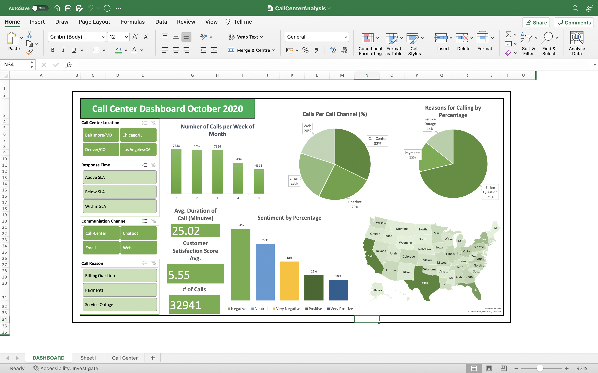
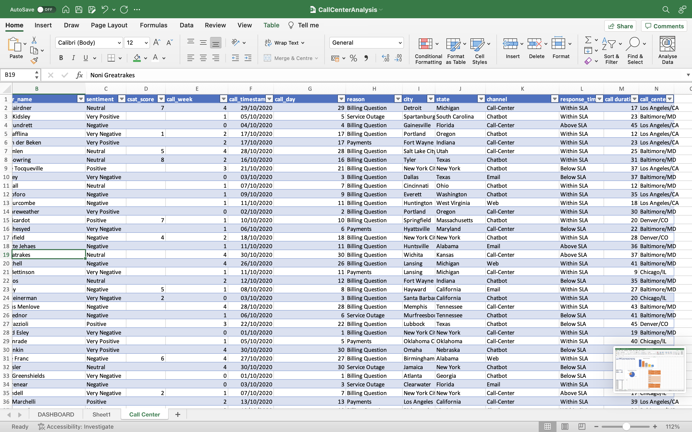
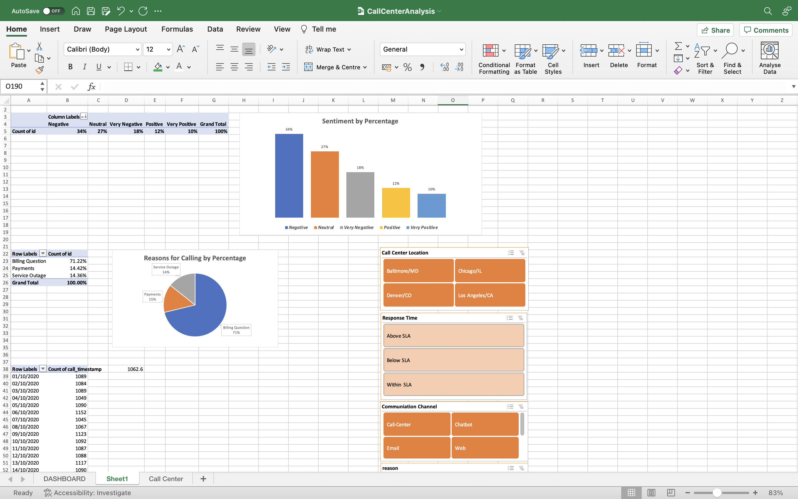
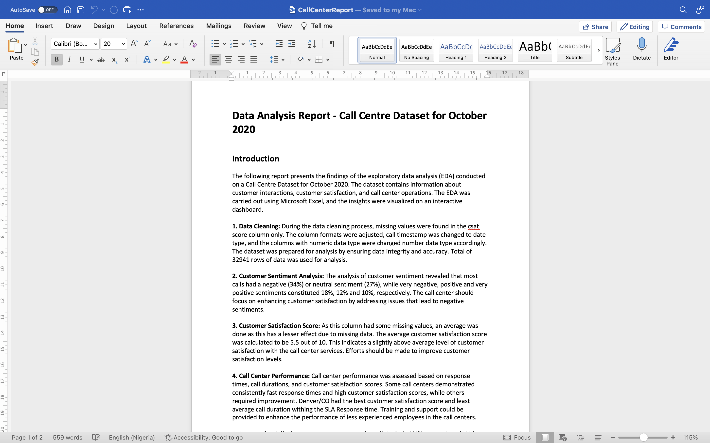

# Call Centre Dataset - Exploratory Data Analysis
#### Call Center Data Analysis with Interactive Dashboard and Report

## Introduction

This repository contains the Call Centre Dataset for October 2020 and the associated Exploratory Data Analysis (EDA) performed using Microsoft Excel. The dataset includes valuable information such as customer names, customer sentiment, customer satisfaction score, employee details, reason for call, call channel, call timestamp, state, response time, and call duration.

## Dataset Description

The Call Centre Dataset for October 2020 comprises the following fields:

- customer_name: The name of the customer who made the call.
- sentiment: The sentiment of the customer during the call (e.g., positive, neutral, negative).
- csat_score: The satisfaction score given by the customer after the call.
- reason: The reason cited by the customer for making the call.
- channel: The communication channel used for the call (e.g., phone, email, chat).
- call_timestamp: The date and time when the call was initiated.
- state: The location or state from which the call was made.
- response_time: The time taken by the employee to respond to the call.
- call_duration: The total duration of the call.

## Exploratory Data Analysis

Exploratory Data Analysis (EDA) was conducted on the Call Centre Dataset using Microsoft Excel to uncover meaningful insights and patterns within the data. The primary objectives of the analysis were to understand customer behavior, call center performance, call center efficiency.

The EDA involved the following key steps:

- Data Cleaning: The dataset was carefully cleaned to handle missing values, remove duplicates, and correct any data inconsistencies.
- Data Summarization: Relevant statistics and summary metrics were calculated to gain a broad overview of the dataset, such as average customer satisfaction scores and call durations.
- Customer Sentiment Analysis: The customer sentiment data was analyzed to determine the overall sentiment distribution and identify any trends in customer feedback.
- Call Center Performance: The performance of call center employees was assessed based on response times, call durations, and customer satisfaction scores.
- Reason for Call Analysis: The reasons cited by customers for calling the call center were analyzed to identify the most common issues or concerns.
- Interactive Dashboard: All the insights and visualizations generated during the analysis were combined into an interactive dashboard using Microsoft Excel. The dashboard allowed users to explore the data and gain real-time insights from different angles.

## Report 

The report of the EDA is included (CallCenterReport.docx).

## Repository Structure

- rawdata: This contains the raw data Call Centre Dataset for October 2020 in a suitable format for use with Microsoft Excel.
- CallCenterAnalysis: This is the Microsoft Excel workbook used for the Exploratory Data Analysis and within it is the interactive dashboard in the First Sheet.
- CallCenterReport: This is the report explaining the trends gotten from the analysis and the recommended actions to be taken.
- CallCenterPP: Powerpoint presentation of the CallCenterReport.

### To access and interact with the Call Centre Dataset and the interactive dashboard:

- Download or clone this repository to your local machine.
- Open the Microsoft Excel workbook (CallCenterAnalysis.xlsx).
- Refresh the data connections to update the dashboard with the latest information.
- Use the interactive dashboard to explore the Call Centre Dataset, visualize insights, and filter data based on different criteria.

## Acknowledgments

I extend my appreciation to the call center team, and Kaggle user (mesumraza) for their efforts in data collection.

If you have any questions, feedback, or suggestions, feel free to reach out to me. 

Email: chriskachi.okoro@gmail.com

LinkedIn: https://www.linkedin.com/in/chris-dataanalyst/
